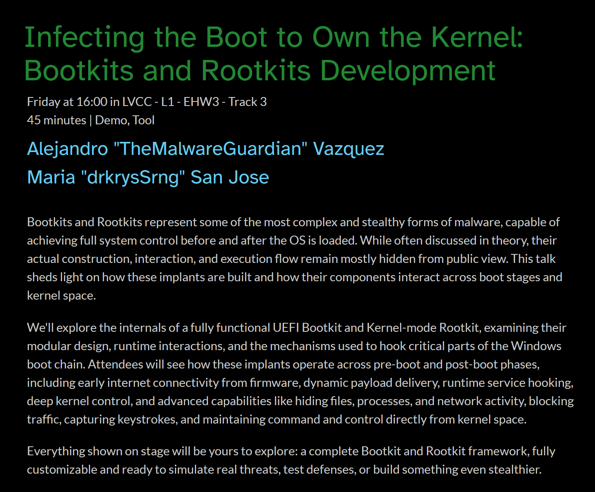

# ***🏴‍☠️ Benthic: Windows Kernel Rootkit***

This is the **official repository** for the **Benthic Windows Kernel-Mode Rootkit**, the kernel component of the **[Abyss UEFI Bootkit](https://github.com/TheMalwareGuardian/Abyss)**, to be presented during our upcoming **[DEF CON 33 Main Stage Talk](https://defcon.org/html/defcon-33/dc-33-speakers.html#content_60321)**.

The full release of the project will be published here after the talk.

	

## ***👥 Meet the Malware Developers***

DEF CON is the most legendary hacking conference in the world, but some editions are more special than others. It's not often that malware source code is shared publicly, and when it comes to bootkits, you can count on one hand the number of times full source code has ever been released. DEF CON 33 will be one of those rare moments, because never before has so much code and documentation been shared to help others develop and understand the most advanced types of malware: a UEFI bootkit and a Windows kernel-mode rootkit.

During our talk, you'll see the bootkit running on a physical machine with Secure Boot enabled. Due to time constraints, most demos will be shown as pre-recorded videos. However, if you'd like to see any demo live, ask in-depth questions, or need help compiling and setting up the environment, feel free to reach out to us on LinkedIn during the conference. We're **[Alejandro](https://www.linkedin.com/in/vazquez-vazquez-alejandro)** and **[María](https://www.linkedin.com/in/mariasanjose)**, the creators of this project, and we're very approachable. We'll gladly find time to talk, walk you through the details, or just have a good conversation.

<table style="border: none;">
	<tr style="border: none;">
		<td align="center" style="vertical-align:top; padding: 10px; width: 250px; border: none;">
			<a href="https://github.com/TheMalwareGuardian">
				
				 
				<b>Alejandro Vázquez</b>
			</a>
			 
			Red Team Operator & Reverse Engineer
		</td>
		<td align="center" style="vertical-align:top; padding: 10px; width: 250px; border: none;">
			<a href="https://github.com/drkrysSrng">
				
				 
				<b>María San José</b>
			</a>
			 
			Malware & Forensics Analyst
		</td>
	</tr>
</table>

